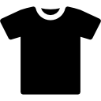

<a name="readme-top"></a>

[![Contributors][contributors-shield]][contributors-url]
[![Forks][forks-shield]][forks-url]
[![Stargazers][stars-shield]][stars-url]
[![Issues][issues-shield]][issues-url]
[![MIT License][license-shield]][license-url]
[![LinkedIn][linkedin-shield]][linkedin-url]

<!-- PROJECT LOGO -->
<br />
<div align="center">
  <a href="https://github.com/EmePin/StylesShop">
    
  </a>

  <h3 align="center">StyleShop-README</h3>

  <p align="center">
    Readme del proyecto de un sitio web para un ecommerce con paypal.
    <br />
    <a href="https://github.com/EmePin/StylesShop"><strong>Explora los documentos »</strong></a>
    <br />
    <br />
    <a href="https://emepin.github.io/StylesShop/index.html">Ver demo del sitio web</a>
    ·
    <a href="https://github.com/EmePin/StylesShop/issues">Reporta un Bug</a>
    ·
    <a href="https://github.com/EmePin/StylesShop/issues">Solicitar cambios</a>
    ·
    <a href="https://github.com/EmePin/StylesShop/archive/refs/heads/main.zip">Descargar</a>
  </p>
</div>

<!-- TABLE OF CONTENTS -->
<br>
  <summary>Tabla de contenido</summary>
  <br>
  <ol>
    <li>
      <a href="#acerca-del-proyecto">Acerca del proyecto</a>
      <ul>
        <li><a href="#construído-con">Construído con</a></li>
      </ul>
    </li>
    <li>
      <a href="#para-empezar">Para empezar</a>
      <ul>
        <li><a href="#prerequisitos">Prerequisitos</a></li>
        <li><a href="#instalación">Instalación</a></li>
      </ul>
    </li>
    <li><a href="#usos">Usos</a></li>
    <li><a href="#licencia">Licencia</a></li>
    <li><a href="#contacto">Contacto</a></li>
    <li><a href="#créditos">Créditos</a></li>
  </ol>

## Acerca del proyecto

Proyecto de un sitio web para un comercio con localstorage que implementa pagos con paypal desarrollado para la materia de Tecnologías Emergentes.
<br>
<br>
<a href="https://github.com/EmePin/StylesShop">

</a>
<br>
<br>

<a href="https://emepin.github.io/StylesShop/index.html">Ver demo del sitio web</a>
<br>
<a href="https://github.com/EmePin/StylesShop/archive/refs/heads/main.zip">Descargar código fuente</a>

<p align="right">(<a href="#readme-top">back to top</a>)</p>

### Construído con

-   
-   
-   [![Bootstrap][bootstrap.com]][bootstrap-url]
-   
-   
-   [![JQuery][jquery.com]][jquery-url]
-   

<p align="right">(<a href="#readme-top">back to top</a>)</p>

## Para empezar

Para obtener una copia local de este repositorio se puede clonar o descargar.

```sh
  git clone EmePin/StylesShop
```

### Prerequisitos

1. Contar con un navegador para la lectura de index.html

### Instalación

1.  Crear una cuenta de negocios en [paypal](https://paypal.com)
2.  Entrar a [paypal developer dashboard](https://developer.paypal.com/dashboard/) y crear una app para que se proporcione un cliente id y dos cuentas de prueba en el modo sandbox.
3.  Reemplazar en el head de carrito.html el client-id

          ```sh
            <script
                src="https://www.paypal.com/sdk jsclient-id=CHANGE_YOUR_ID_CLIENTE&currency=MXN">
            </script>
          ```

<p align="right">(<a href="#readme-top">back to top</a>)</p>

<!-- USAGE EXAMPLES -->

## Uso

A continuación se muestra el funcionamiento correcto del sitio web y del pago por medio de paypal de los artículos del carrito alojados con localstorage.
<br>
<br>
<a href="https://youtu.be/bAouFetu6hI">
¡Ver video de funcionamiento!
</a>
<br>
<br>

 <a href="https://github.com/EmePin/StylesShop">
    
  </a>
<a href="https://github.com/EmePin/StylesShop">
    
  </a>
  <a href="https://github.com/EmePin/StylesShop">
    
  </a>
  <a href="https://github.com/EmePin/StylesShop">
    
  </a>
  <a href="https://github.com/EmePin/StylesShop">
    
  </a>
  <a href="https://github.com/EmePin/StylesShop">
    
  </a>
  <a href="https://github.com/EmePin/StylesShop">
    
  </a>
  
<p align="right">(<a href="#readme-top">back to top</a>)</p>

## Licencia


Distribuído bajo la licencia MIT. Leer `LICENSE.txt` para más información.

<p align="right">(<a href="#readme-top">back to top</a>)</p>

<!-- CONTACT -->

## Contacto

[](https://instagram.com/eme_aim) [](https://linkedin.com/in/jahda%c3%ad-p-93aa091b5/) [](https://tiktok.com/@@emebrou) [](https://twitch.tv/eme_aim) [](https://youtube.com/@aimeepineda8400)

Project Link: [StylesShop.git](https://github.com/EmePin/StylesShop.git)
<br>
Mi perfil de github Link: [EmePin](https://github.com/EmePin)

<p align="right">(<a href="#readme-top">back to top</a>)</p>

## Créditos

Recursos que me resultaron útiles y a los que me gustaría dar crédito.

-   [Carpi Coder](https://www.youtube.com/watch?v=RiB4mV3VnRY&t=1974s&ab_channel=CarpiCoder)
-   [Bartosz Maryniaczyk](https://unblast.com/free-e-commerce-dashboard-ui-template-fig/t)
-   [GitHub Emoji Cheat Sheet](https://www.webpagefx.com/tools/emoji-cheat-sheet)
-   [Imágenes de la ropa](https://www.pinterest.com.mx/meghan200303/)
-   [Paleta de colores](https://palette.site/)
-   [Img Shields](https://shields.io)
-   [GitHub Pages](https://pages.github.com)
-   [Font google](https://fonts.google.com/)
-   [Flavicons](https://flavicon.com)
-   [boostrap icons](https://icons.getbootstrap.com/)

<p align="right">(<a href="#readme-top">back to top</a>)</p>

<!-- MARKDOWN LINKS & IMAGES -->
<!-- https://www.markdownguide.org/basic-syntax/#reference-style-links -->

[contributors-shield]: https://img.shields.io/github/contributors/EmePin/StylesShop.svg?style=for-the-badge
[contributors-url]: https://github.com/EmePin/StylesShop/graphs/contributors
[forks-shield]: https://img.shields.io/github/forks/EmePin/StylesShop.svg?style=for-the-badge
[forks-url]: https://github.com/EmePin/StylesShop/network/members
[stars-shield]: https://img.shields.io/github/stars/EmePin/StylesShop.svg?style=for-the-badge
[stars-url]: https://github.com/EmePin/StylesShop/stargazers
[issues-shield]: https://img.shields.io/github/issues/EmePin/StylesShop.svg?style=for-the-badge
[issues-url]: https://github.com/EmePin/StylesShop/issues
[license-shield]: https://img.shields.io/github/license/EmePin/StylesShop.svg?style=for-the-badge
[license-url]: https://github.com/EmePin/StylesShop/blob/main/LICENSE.txt
[linkedin-shield]: https://img.shields.io/badge/-LinkedIn-black.svg?style=for-the-badge&logo=linkedin&colorB=555
[linkedin-url]: https://www.linkedin.com/in/jahda%C3%AD-p-93aa091b5/
[product-screenshot]: images/screenshot.png
[javascript]: https://developer.mozilla.org/es/docs/Web/JavaScript
[bootstrap.com]: https://img.shields.io/badge/Bootstrap-563D7C?style=flat-square&logo=bootstrap&logoColor=white
[bootstrap-url]: https://getbootstrap.com
[jquery.com]: https://img.shields.io/badge/jQuery-0769AD?style=flat-square&logo=jquery&logoColor=white
[jquery-url]: https://jquery.com
